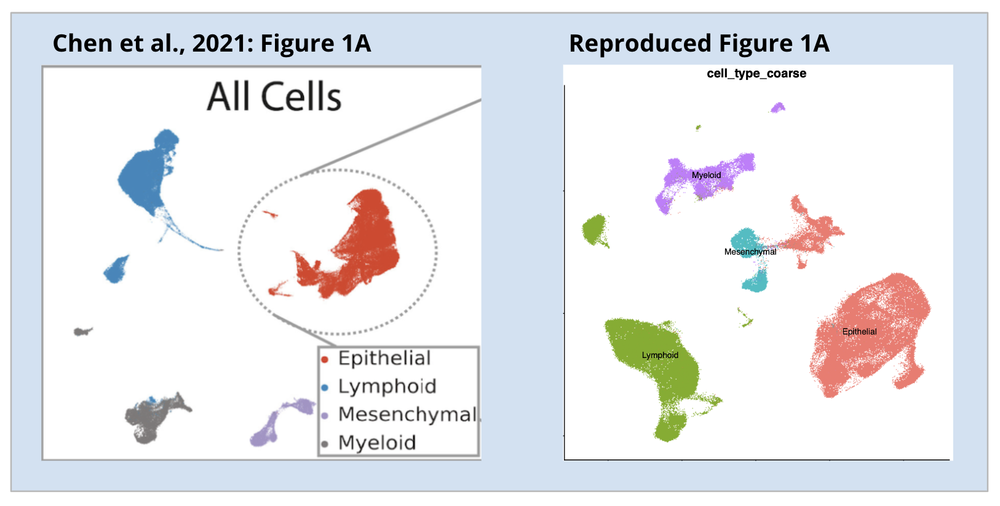

# Publication Reproducibility
NCI Human Tumor Atlas Network (HTAN) Data Jamboree | Dec. 4-7, 2023

**Introduction**
-------
Data reproducibility is a fundamental principle in science and allows for scientific validation, confidence in research, and for the scientific community to build on each other's findings. Transparency of methods and data availability is essential in all scientific fields and promotes more effecient progress in furthering understandings and discoveries. [(article)](https://www.nature.com/articles/d42473-019-00004-y)

**Goals**
-------
We are focusing on assessing single cell data reproducibilty defined by:
* Regenerating computational figures
* Reproducing cell type annotation from re-clustering and analysis
* Looking at DGE analysis and seeing how this compares to published results
* Obtaining and reusing experimental metadata for figure generation

**Methods**
-------
* Choose dataset from HTAN data portal
* Recreate data object from raw count matrix and obtain relevant metadata
* Cluster and batch correct:
	- [RPCA](https://www.rdocumentation.org/packages/rsvd/versions/1.0.5/topics/rpca) 
	- [LIGER](https://github.com/welch-lab/liger)
	- [fastMNN](https://rdrr.io/github/satijalab/seurat-wrappers/man/RunFastMNN.html)

**Data download**
-------
* The dataset we chose is the small cell lung cancer (SCLC) found at [HTAN MSK](https://humantumoratlas.org/explore?selectedFilters=%5B%7B%22group%22%3A%22AtlasName%22%2C%22value%22%3A%22HTAN+MSK%22%7D%5D)
* Downloaded from Chan Zuckerberg CELLxGENE: [Collection](https://cellxgene.cziscience.com/collections/62e8f058-9c37-48bc-9200-e767f318a8ec)

**References**
-------
* Chan JM, Quintanal-Villalonga A, Gao VR, Xie Y, Allaj V, Chaudhary O, Masilionis I, Egger J, Chow A, Walle T, Mattar M, Yarlagadda DVK, Wang JL, Uddin F, Offin M, Ciampricotti M, Qeriqi B, Bahr A, de Stanchina E, Bhanot UK, Lai WV, Bott MJ, Jones DR, Ruiz A, Baine MK, Li Y, Rekhtman N, Poirier JT, Nawy T, Sen T, Mazutis L, Hollmann TJ, Pe'er D, Rudin CM. **Signatures of plasticity, metastasis, and immunosuppression in an atlas of human small cell lung cancer.** Cancer Cell. 2021;39(11):1479-96 e18. Epub 20211014. doi: 10.1016/j.ccell.2021.09.008. PubMed PMID: 34653364; PMCID: PMC8628860. [Link](https://www.cell.com/cancer-cell/fulltext/S1535-6108(21)00497-9)

## Code
* We have organized the code in the repo based off of the figure number in the original paper.

## Results
* Given the raw count expression matrix and metadata from the publication supplemental documents, we've been able to regenerate very comparable figures from the publication.
* For panels that we cannot replicate, we showed qualitatively comparable results
* The original study performed fastMNN integration to remove patient-specific heterogeneity, but during the data replication, we did not see any major differences in DEGs due to that. Therefore the integration was only targeting the patient-specific tumor heterogeneity. 

**Team**
-------
* **Zheng Xia**, Oregon Health & Science University
* **Hanbing Song**, University of California, San Francisco
* **Jennifer Chien**, Stanford University
* **Linna Peng**, Genentech
* **Jim Chaffer**, Stanford University