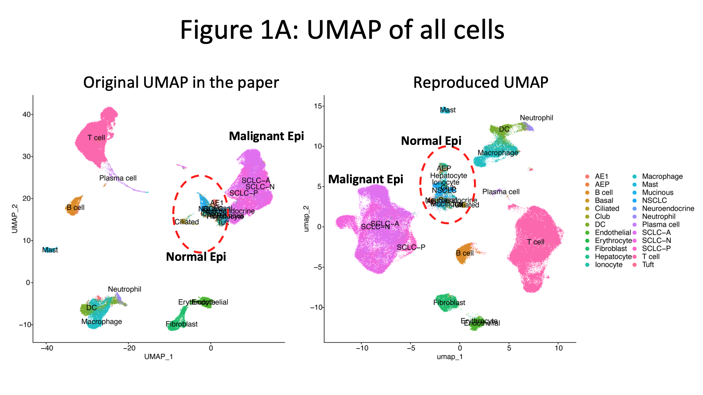
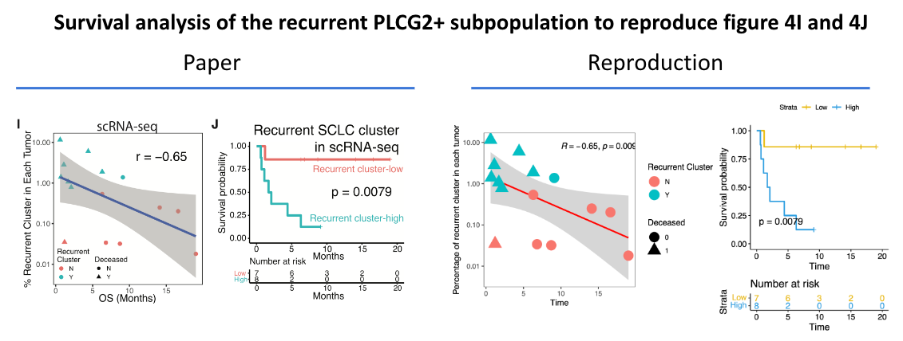
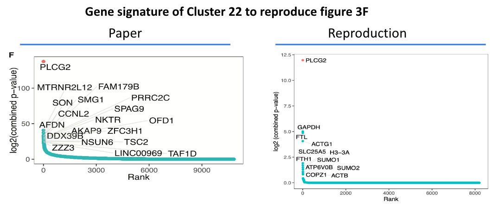

# Evaluate the reproducibility of HTAN Publication
NCI Human Tumor Atlas Network (HTAN) Data Jamboree | Dec. 4-7, 2023

**Introduction**
-------
Data reproducibility is a fundamental principle in science and allows for scientific validation, confidence in research, and for the scientific community to build on each other's findings. Transparency of methods and data availability is essential in all scientific fields and promotes more effecient progress in furthering understandings and discoveries. [(article)](https://www.nature.com/articles/d42473-019-00004-y)

**Goals**
-------
We are focusing on assessing single cell data reproducibilty defined by:
* Regenerating computational figures
* Reproducing cell type annotation from re-clustering and analysis
* Looking at differential gene expression analysis and seeing how this compares to published results
* Obtaining and reusing experimental metadata for figure generation

**Methods**
-------
* Choose dataset from HTAN data portal
* Recreate data object from raw count matrix and obtain relevant metadata
* Cluster with Seurat and Scanpy workflows and batch correct:
	- [RPCA](https://satijalab.org/seurat/articles/integration_rpca.html) 
	- [LIGER](https://github.com/welch-lab/liger)
	- [fastMNN](https://rdrr.io/github/satijalab/seurat-wrappers/man/RunFastMNN.html)
* Assess reproducibility of publication figures

**Data download**
-------
* The dataset we chose is the small cell lung cancer (SCLC) found at [HTAN MSK](https://humantumoratlas.org/explore?selectedFilters=%5B%7B%22group%22%3A%22AtlasName%22%2C%22value%22%3A%22HTAN+MSK%22%7D%5D)
* Downloaded from Chan Zuckerberg CELLxGENE: [Collection](https://cellxgene.cziscience.com/collections/62e8f058-9c37-48bc-9200-e767f318a8ec)

**References**
-------
* Chan JM, Quintanal-Villalonga A, Gao VR, Xie Y, Allaj V, Chaudhary O, Masilionis I, Egger J, Chow A, Walle T, Mattar M, Yarlagadda DVK, Wang JL, Uddin F, Offin M, Ciampricotti M, Qeriqi B, Bahr A, de Stanchina E, Bhanot UK, Lai WV, Bott MJ, Jones DR, Ruiz A, Baine MK, Li Y, Rekhtman N, Poirier JT, Nawy T, Sen T, Mazutis L, Hollmann TJ, Pe'er D, Rudin CM. **Signatures of plasticity, metastasis, and immunosuppression in an atlas of human small cell lung cancer.** Cancer Cell. 2021;39(11):1479-96 e18. Epub 20211014. doi: 10.1016/j.ccell.2021.09.008. PubMed PMID: 34653364; PMCID: PMC8628860. [Link](https://www.cell.com/cancer-cell/fulltext/S1535-6108(21)00497-9)

## Code
* We have organized the code in the repo based off of the figure number in the original paper.

## Results
* Given the raw count expression matrix and metadata from the publication supplemental documents, we've been able to regenerate very comparable figures from the publication. For panels that we cannot replicate, we showed qualitatively comparable results
* The original study performed fastMNN integration to remove patient-specific heterogeneity, but during the data replication, we did not see any major differences in differentially expressed genes due to that. Therefore the integration was only targeting the patient-specific tumor heterogeneity. 
* Immune and mesenchymal clustering and cell type annotations were more readily reproducible as they did not contain a significant amount of inherit patient-specific heterogeneity.
* Aspect that made reproducibility achievable:
	- Raw counts gene expression matrix readily available
	- Donor id to map relevant experimental metadata to figures
	- Code availability in github
	- Cell type annotations accessible in Seurat and AnnData formats
* Suggestion for [FAIR](https://www.nature.com/articles/sdata201618) standard:
	- To better match the curated data object and the raw count matrices in GEO, authors should consider use the original barcodes from cellranger output.
	- Elaboration of some initial processing is required to ensure better replication of the data (the cellphoneDB processing, for example)
	- Finer details are desired for integration/clustering method.

##

##

##

**Team**
-------
* **Zheng Xia**, Oregon Health & Science University
* **Hanbing Song**, University of California, San Francisco
* **Jennifer Chien**, Stanford University
* **Linna Peng**, Genentech
* **Jim Chaffer**, Stanford University

**Acknowledgements**
We want to thank National Cancer Institute of the NIH and Human Tumor Atlas Network (HTAN) for putting together this event and providing an opportunity to explore data reproducibility.
